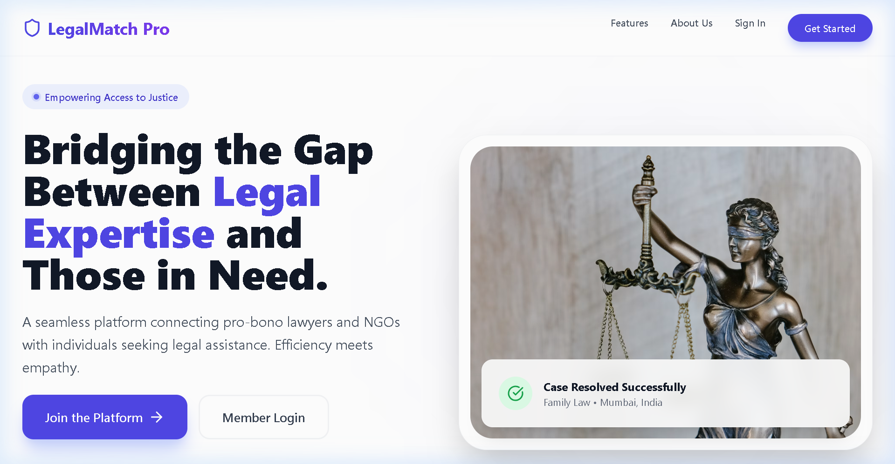
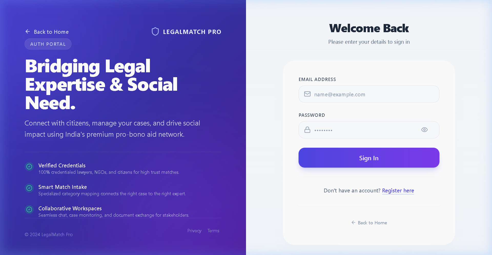
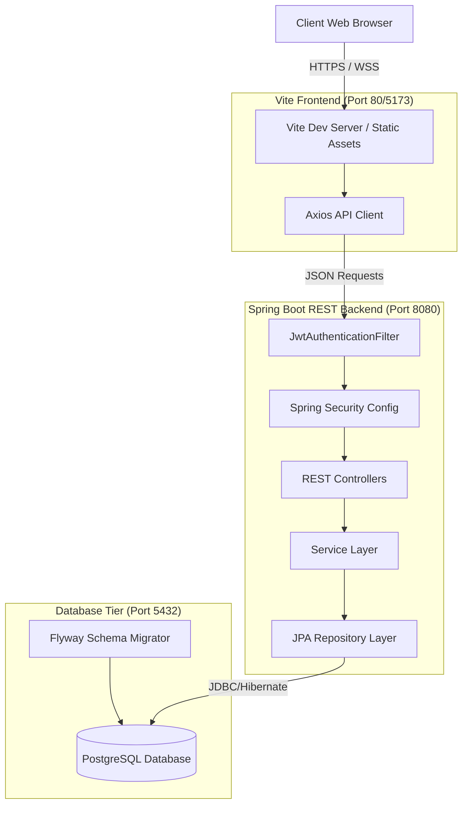
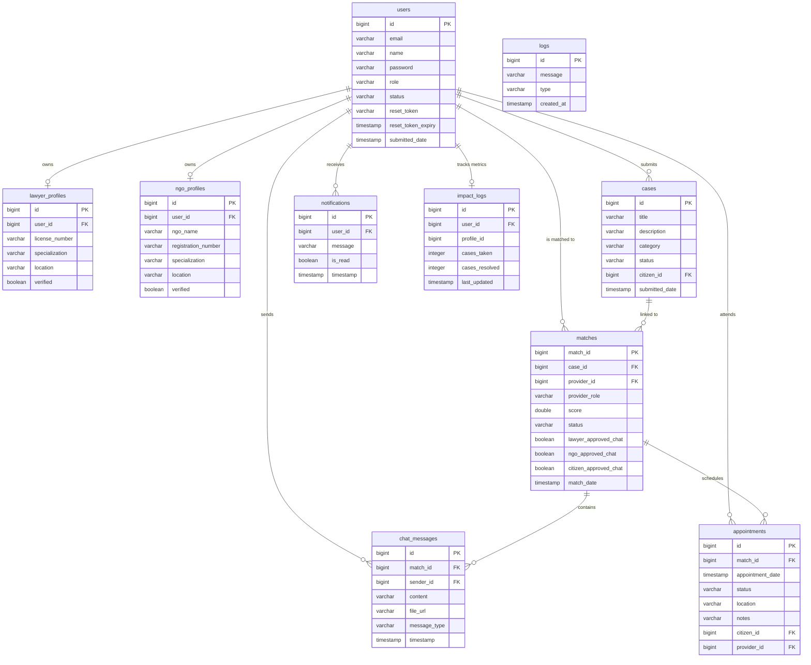

# LegalMatch Pro — Legal Aid Matching Platform

<p align="center">
  
  
  
  
  
  
  
  
</p>

**LegalMatch Pro** is a full-stack, secure, social impact platform built to bridge the gap between citizens seeking legal assistance and service providers (verified lawyers and NGOs) who can offer aid. It streamlines case intake, automates matchmaking, and provides real-time communication channels, all managed through secure administrative and analytical oversight.

---

## 🔗 Live Demo

* **Frontend App (Vercel):** `https://legal-match-pro.vercel.app`
* **Backend API (Render):** `https://legal-match-pro.onrender.com`
* **Swagger API Documentation:** `https://legal-match-pro.onrender.com/swagger-ui.html`

---

## 📸 Screenshots

### Landing Page & Authentication
| Landing Page | Login (Redesigned) |
| :---: | :---: |
|  |  |

### Role Dashboards
| Citizen Dashboard | Lawyer Dashboard |
| :---: | :---: |
|  |  |

| NGO Dashboard | Admin Panel |
| :---: | :---: |
|  |  |

### Operational Features
| Analytics Dashboard | Real-Time Chat |
| :---: | :---: |
|  |  |

---

## ✨ Features (Module-wise)

### 🔑 Authentication
* Role-based registration and login flows for `CITIZEN`, `LAWYER`, `NGO`, and `ADMIN`.
* Secure stateless authentication using JSON Web Tokens (Access + Refresh token model).
* Password hashing using BCrypt.
* Password recovery flows (Forgot Password and Reset Password).

### 📁 Case Management
* Citizens can submit legal cases with titles, descriptions, categories, and locations.
* Citizens track their case histories with status indicators (`OPEN`, `MATCHED`, `RESOLVED`).
* Automated indexing and search capability on cases by status.
* Status update authorization limits (Only Admins and assigned Lawyers can update case status).

### 🔍 Directory Management
* Lawyer Directory: Filter by specialization/expertise, location, and verification status with server-side pagination and sorting.
* NGO Directory: Filter by expertise area, location, and verification status.
* Administrative Data Ingestion: Trigger imports to seed the database from Excel sheets (via Apache POI) and external endpoints.

### 🧠 Matching Engine
* Score-based algorithmic matchmaking mapping cases to nearby providers matching the specialization required.
* Double-opt-in matching: Citizens request chat permissions, and legal providers must approve before open communication starts.
* Complete match status tracking (`PENDING`, `REQUESTED`, `ACCEPTED`, `REJECTED`).

### 💬 Communication
* Direct, match-restricted message logging and history retrieval.
* WebSocket with STOMP protocol support to establish real-time chat handshakes.
* JWT authentication validation during WebSocket connect phase.

### 📅 Appointment Scheduling
* Schedule face-to-face or digital consults linked directly to active case matches.
* Real-time status update validation for appointments (`SCHEDULED`, `COMPLETED`, `CANCELLED`).

### 🔔 Notifications
* System-wide notifications generated on major lifecycle events (matching, chat request approvals, appointment updates).
* Status modification indicators (mark-as-read endpoints).

### 📊 Analytics
* Real-time KPI summaries: Total Users, Total Cases, Match Rates, and Resolved Cases.
* Graphical trend charts: Month-wise user registrations and case growth patterns.
* Visual segmentation panels: User roles and case status distribution counts.

### 🛡️ Admin Features
* Verification Center: Review and approve/reject pending registrations of Lawyers and NGOs.
* System Monitoring: View chronological error and activity logs retrieved directly from the database.
* Directory administration tools.

---

## 🛠️ Tech Stack

* **Frontend:** React, Vite, Tailwind CSS, Axios, React Router, Recharts, React Leaflet (maps)
* **Backend:** Java 17, Spring Boot 3.2.5, Spring Security, Spring Data JPA, Spring WebSocket
* **Database:** PostgreSQL, Flyway Migrations, H2 Database (local unit testing)
* **Build Tools:** Maven, npm, Git
* **Containers & CI/CD:** Docker, Docker Compose, GitHub Actions

---

## 🏗️ Architecture



---

## 📊 Database Schema (ER Diagram)

The PostgreSQL database contains the following tables mapped using JPA/Hibernate:



---

## 🔒 Security Implementation

* **JWT Stateless Sessions:** Spring Security intercepts incoming REST requests, validating tokens via the `JwtAuthenticationFilter`.
* **Method-Level Security:** Secure endpoint protection is handled via `@PreAuthorize("hasRole('ADMIN')")` or `@PreAuthorize("hasAnyRole('ADMIN', 'LAWYER')")` checks at the controller method level.
* **CORS Guarding:** Configured globally inside `SecurityConfig` to restrict traffic except from domains defined in `app.cors.allowed-origins`.
* **Password Protections:** Hashing is executed via `BCryptPasswordEncoder`.

---

## ⚙️ Environment Variables

### Backend (`backend/.env` or OS Environment)
```bash
SPRING_DATASOURCE_URL=jdbc:postgresql://localhost:5432/legalmatch_db
SPRING_DATASOURCE_USERNAME=your_db_user
SPRING_DATASOURCE_PASSWORD=your_db_password
JWT_SECRET=your_32_plus_character_secure_jwt_secret_key
CORS_ALLOWED_ORIGINS=http://localhost:5173,http://localhost:3000
```

### Frontend (`frontend/.env.development` & `.env.production`)
```bash
VITE_API_URL=/api
VITE_API_BASE_URL=/api
VITE_API_WS_URL=/ws
```

---

## 🚀 Local Development Setup

### 1. Clone Repository
```bash
git clone https://github.com/vivekkushwahaofficial/LegalMatch-Pro.git
cd legal-aid-matching-platform-b13
```

### 2. Database Initialization
Ensure PostgreSQL is running locally:
```sql
CREATE DATABASE legalmatch_db;
```

### 3. Start Backend
Load your `.env` variables and run the boot script:
```bash
cd backend
# Windows (PowerShell)
$env:SPRING_DATASOURCE_URL="jdbc:postgresql://localhost:5432/legalmatch_db"; $env:SPRING_DATASOURCE_USERNAME="postgres"; $env:SPRING_DATASOURCE_PASSWORD="yourpassword"; $env:JWT_SECRET="dev-only-secret-key-must-be-32-chars-min!!"; mvn spring-boot:run

# Unix
export SPRING_DATASOURCE_URL="jdbc:postgresql://localhost:5432/legalmatch_db"
export SPRING_DATASOURCE_USERNAME="postgres"
export SPRING_DATASOURCE_PASSWORD="yourpassword"
export JWT_SECRET="dev-only-secret-key-must-be-32-chars-min!!"
mvn spring-boot:run
```

### 4. Start Frontend
```bash
cd ../frontend
npm install
npm run dev
```
Open `http://localhost:5173/` in your browser.

---

## 🐳 Docker Deployment Setup

The repository is pre-configured for containerized execution.

### Local Docker Boot
Build all images and run the full stack (Nginx, Spring Boot, Postgres) locally in detached mode:
```bash
docker compose up -d --build
```
Verify container status:
```bash
docker compose ps
```

---

## ☁️ Deployment Instructions

### 1. Database Setup (Neon PostgreSQL)
1. Provision a database instance on the Neon console.
2. Extract the PostgreSQL connection URL.
3. Configure the environment variables in Render/Railway:
   * Set `SPRING_DATASOURCE_URL` to `jdbc:postgresql://your-neon-hostname/neondb?sslmode=require`.

### 2. Backend Deployment (Render)
1. Create a **Web Service** on Render and link the GitHub repository.
2. Select the `backend` folder as the root directory.
3. Set the build command to `./mvnw clean package -DskipTests` (or `mvn clean package -DskipTests`).
4. Set the start command to `java -jar target/backend-0.0.1-SNAPSHOT.jar` (or select the appropriate jar file).
5. Load the environment variables (`SPRING_DATASOURCE_URL`, `SPRING_DATASOURCE_PASSWORD`, `JWT_SECRET`, etc.).

### 3. Frontend Deployment (Vercel)
1. Set the root directory of your project in Vercel to `frontend`.
2. Vercel will automatically compile Vite's SPA bundle and deploy the static assets.
3. Define the `VITE_API_URL` to point to the absolute URL of the deployed backend.

---

## 🛡️ CI/CD Pipelines

A GitHub Actions pipeline config is defined in [.github/workflows/ci.yml](file:///.github/workflows/ci.yml):
* **Backend Build & Test:** Instantiates an isolated Docker PostgreSQL container, compiles Java 17, and runs the entire Spring unit/integration test suite.
* **Frontend Compilation:** Runs npm installations, syntax compliance, and builds production bundles.
* **Docker Validation:** Automatically checks the syntax of the compose configuration files.

---

## 🧪 Testing

The backend includes comprehensive testing configurations. Run tests locally using:
```bash
cd backend
mvn test
```

### Key Test Categories:
* **Context Loading Checks:** `BackendApplicationTests.java`
* **Controller Boundaries & Security:** `DirectoryEndpointSecurityTest.java`, `MilestoneApiIntegrationTest.java`
* **Service Authorization:** `AuthServiceTest.java`, `CaseServiceAuthorizationTest.java`, `MatchingServiceAuthorizationTest.java`

---

## 📂 Project Directory Structure

```text
legal-aid-matching-platform-b13/
├── .github/
│   └── workflows/
│       └── ci.yml               # GitHub Actions CI workflow
├── backend/
│   ├── src/
│   │   ├── main/
│   │   │   ├── java/com/legalmatch/backend/
│   │   │   │   ├── config/      # Security & Validation Configs
│   │   │   │   ├── controller/  # REST Endpoints
│   │   │   │   ├── entity/      # JPA Hibernate entities
│   │   │   │   ├── repository/  # Query/Data Layer
│   │   │   │   └── service/     # Business Layer (Matching, Auth)
│   │   │   └── resources/
│   │   │       ├── db/migration/# Flyway Migration Scripts
│   │   │       ├── application.properties
│   │   │       └── *.xlsx       # Ingestion Seed Data Sheets
│   ├── pom.xml                  # Backend Build config
│   └── Dockerfile               # Backend Multi-stage build setup
├── frontend/
│   ├── src/
│   │   ├── components/          # Widgets (Chat, Dashboard, Layout)
│   │   ├── context/             # Global Auth / Case providers
│   │   ├── pages/               # Views (Dashboard, Signin, Matches)
│   │   ├── routes/              # Protected Navigation Routes
│   │   ├── main.jsx             # React entry file
│   │   └── App.jsx              # Main routing module
│   ├── package.json             # Frontend deps
│   └── Dockerfile               # Nginx reverse proxy container setup
├── scripts/
│   └── generate_data.py         # Mock spreadsheet generator
├── docker-compose.yml           # Local Orchestration compose script
└── generate_xlsx.py             # Alternative generator script
```

---

## 🔮 Future Enhancements

* **AI Recommendation Engine:** Implement Vector Similarity matching on lawyer descriptions to improve candidate suggestion accuracy.
* **Type Indicators & WS Presence:** Add real-time user online/typing indicators over WebSocket connections.
* **Interactive Map Integration:** Incorporate interactive spatial map views to search for legal clinics by state/city boundaries.
* **Notifications Webhooks:** Support external communication endpoints (SMS alerts/Email updates).
